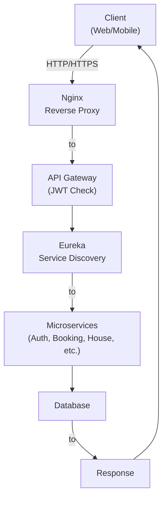
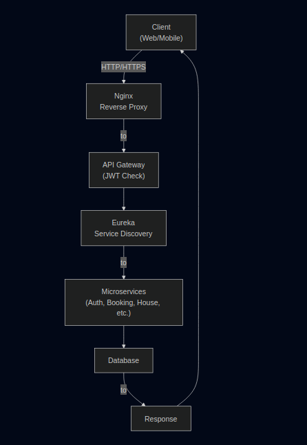
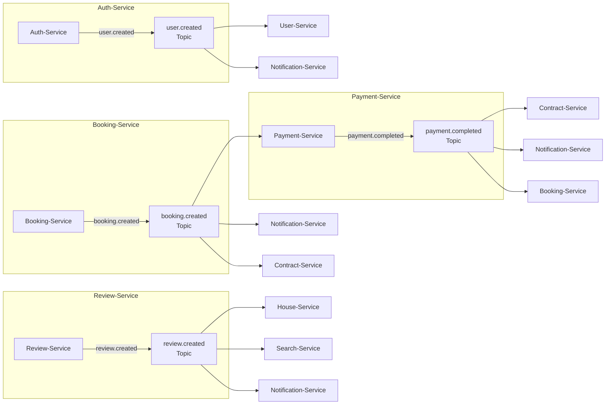
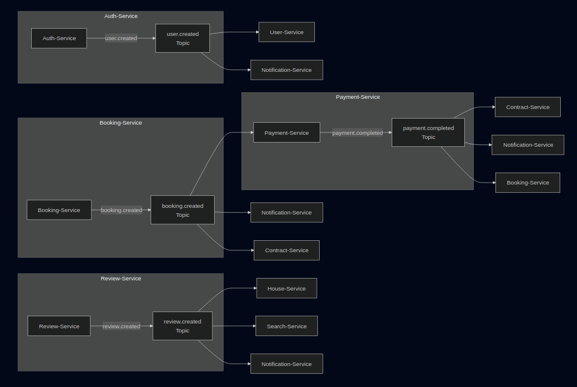
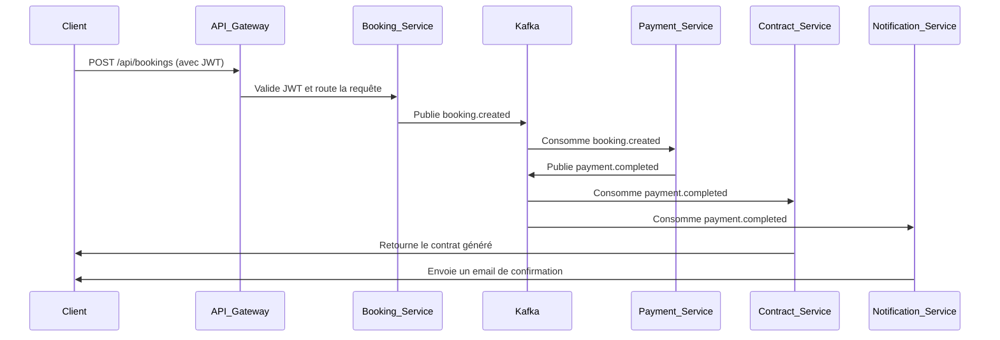
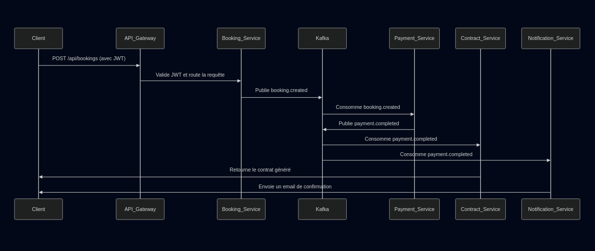

# 🏗️ **HouseBooker — Diagrammes d'Architecture**

---

## 🔁 **Flux Global des Requêtes**

---

---

### **Description du Flux**

1. **Client** : Envoie une requête HTTP/HTTPS.
2. **Nginx** : Termine le SSL/TLS et redirige vers l'API Gateway.
3. **API Gateway** :
- Valide le token JWT.
- Filtre les requêtes.
4. **Eureka** : Fournit l'adresse du service cible.
5. **Microservice** : Traite la requête.
6. **Base de Données** : Stocke ou récupère les données.
7. **Réponse** : Retourne le résultat au client.

---

## 📡 **Architecture Event-Driven avec Kafka**

---

---

### **Description des Topics et Événements**

#### **👤 user.created**

- **Émis par** : Auth-Service
- **Consommé par** :
    - User-Service
    - Notification-Service

#### **📅 booking.created**

- **Émis par** : Booking-Service
- **Consommé par** :
    - Payment-Service
    - Notification-Service
    - Contract-Service

#### **💳 payment.completed**

- **Émis par** : Payment-Service
- **Consommé par** :
    - Contract-Service
    - Notification-Service
    - Booking-Service

#### **⭐ review.created**

- **Émis par** : Review-Service
- **Consommé par** :
    - House-Service (mise à jour du rating)
    - Search-Service (indexation)
    - Notification-Service

---

## 🎯 **Avantages de l'Architecture Event-Driven**

- **Découplage total des services** : Chaque service évolue indépendamment.
- **Communication asynchrone** : Meilleure tolérance aux pannes et scalabilité.
- **Résilience** : Un service en panne n'affecte pas les autres.
- **Extensibilité** : Ajout facile de nouveaux consommateurs d'événements.

---

## 📌 **Exemple de Séquence : Réservation Complète**

---

### **Description de la Séquence**

1. Le client envoie une requête de réservation.
2. L'API Gateway valide le JWT et route la requête vers `Booking-Service`.
3. `Booking-Service` publie un événement `booking.created` sur Kafka.
4. `Payment-Service` consomme l'événement et initie le paiement.
5. Une fois le paiement validé, `Payment-Service` publie `payment.completed`.
6. `Contract-Service` et `Notification-Service` consomment l'événement pour générer un contrat et envoyer une notification.